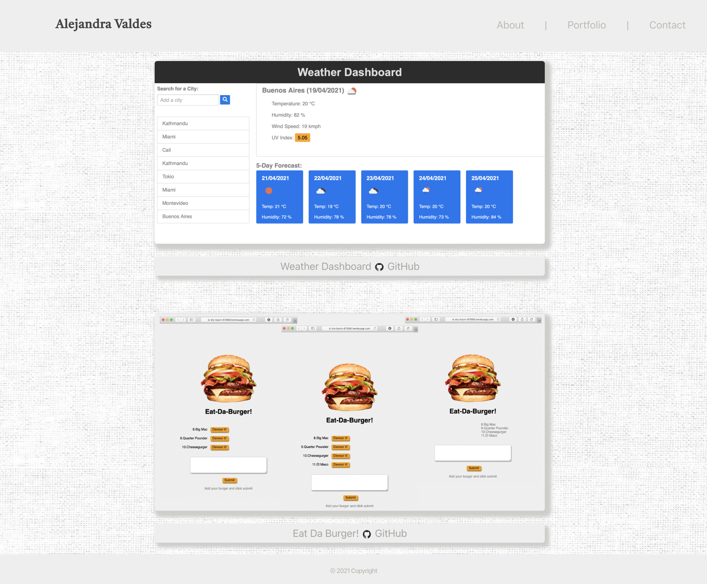
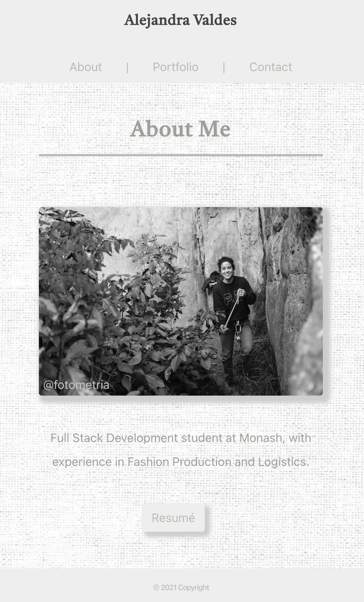
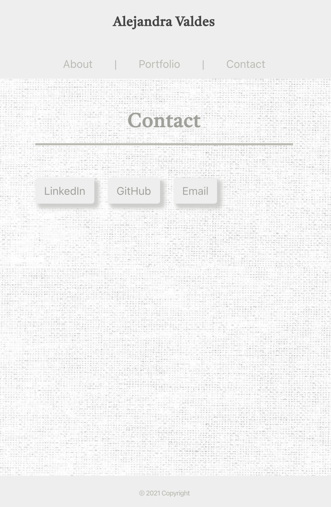

# Portfolio

Coding Bootcamp/02-CSS-Bootstrap/Homework

## Links:

Github pages link: 'https://avpizarro.github.io/reactportfolio/'

Github repository link: 'https://github.com/avpizarro/reactportfolio.git'

### Description: 

The initial portofolio was refactored to use React.

#### Portfolio

#### About me

#### Contact

